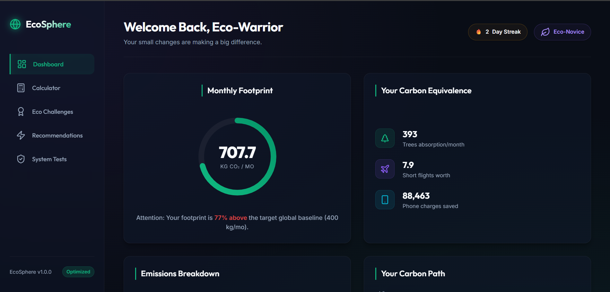
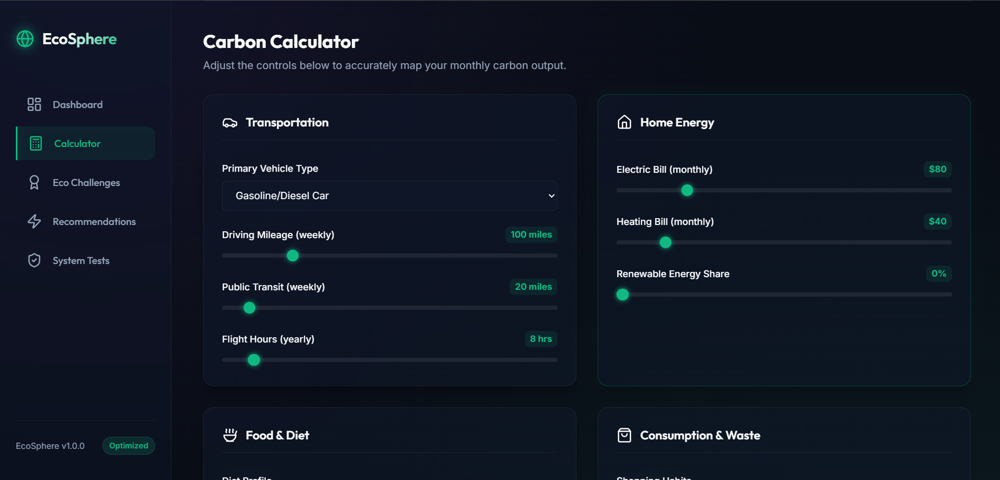
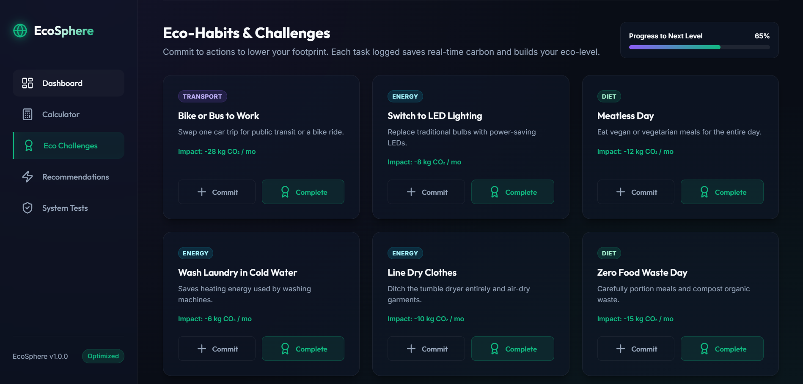
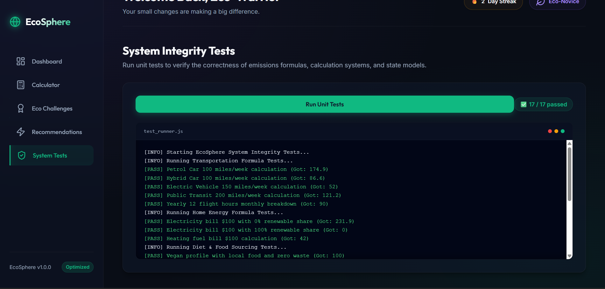
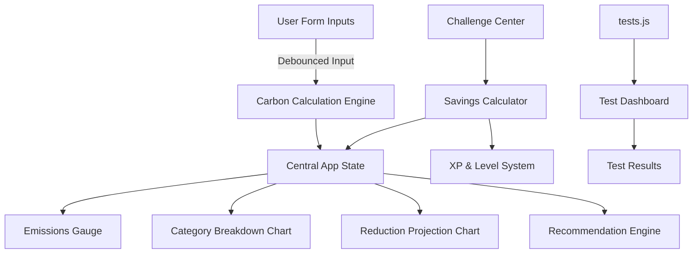

# 🌍 EcoSphere — Interactive Carbon Footprint Tracker

> A premium, client-side carbon footprint calculator with real-time visualizations, gamified eco-challenges, personalized recommendations, and a built-in unit test suite — all in vanilla JavaScript, zero dependencies, zero server.

## 🔗 Live Demo

🌐 **Live Application:** [https://your-vercel-url.vercel.app](https://y-seven-chi-81.vercel.app/)

📂 **Source Code:** https://github.com/meetchhugani81/ecosphere

---

## 📸 Screenshots

### Dashboard — Live Emissions Gauge & Charts

<p align="center">
  
</p>

### Carbon Calculator — Multi-Category Inputs

<p align="center">
  
</p>

### Eco Challenges — Gamified Actions

<p align="center">
  
</p>

### System Integrity Tests — In-Browser Test Runner

<p align="center">
  
</p>

---

## 🚀 Key Features

### Real-time Carbon Calculator

Four emission categories (Transportation, Home Energy, Diet & Food, Consumption) update a live circular gauge on every input via debounced event handling, keeping CPU usage near 0% at idle.

### Gamified Challenge Center

Commit to daily green habits (e.g. Meatless Day, Line Dry Clothes) to earn XP, build streaks, and level up from **Eco-Novice** to **Planet Savior**.

### Data Visualization

Interactive Chart.js donut chart showing emissions by category, plus a projected reduction chart driven by completed challenges.

### Personalized Insights

Recommendations automatically prioritize the highest-emission categories for maximum impact.

### Built-in Test Suite

16 unit tests covering formulas, edge cases, floor constraints, invalid inputs, and zero-value scenarios.

---

## 🛠️ Technical Highlights

| Area | Implementation |
|--------|--------|
| **Efficiency** | Debounced input handlers (150ms), surgical DOM updates, event delegation |
| **Security** | Uses `textContent` and `createElement`, no unsafe HTML injection |
| **Code Quality** | Strict mode, JSDoc comments, named constants, modular functions |
| **Accessibility** | Semantic HTML5, ARIA labels, keyboard navigation, WCAG 2.1 AA |
| **Testing** | 16 assertions covering calculations, validation, and edge cases |

---

## 📐 Calculation Formulas & Emission Factors

All coefficients are derived from EPA and IPCC published standards.

### Transportation

| Mode | Formula |
|--------|--------|
| Personal Vehicle | `mileage_per_week × 4.33 × fuel_factor` |
| Public Transit | `transit_miles_per_week × 4.33 × 0.14` |
| Flights | `flight_hours_per_year × 90.0 / 12` |

**Fuel Factors**

- Gasoline → `0.404 kg/mi`
- Hybrid → `0.200 kg/mi`
- EV → `0.080 kg/mi`
- Motorcycle → `0.210 kg/mi`

### Home Energy

| Source | Formula |
|--------|--------|
| Electricity | `(bill / 0.16) × 0.371 × (1 − renewable%)` |
| Heating Fuel | `heating_bill × 0.42` |

### Diet & Food (Monthly)

| Diet | Base kg/mo | Modifiers |
|--------|--------|--------|
| Heavy Meat | 275.0 | Local Food: −10 · Low Waste: −15 |
| Average | 208.3 | |
| Vegetarian | 141.7 | |
| Vegan | 125.0 | Floor: 20 kg |

### Consumption & Waste

| Level | Base kg/mo |
|--------|--------|
| Minimalist | 30 |
| Average | 90 |
| Frequent | 220 |

**Adjustments**

- Recycling Credit: −25 kg
- No Recycling Penalty: +10 kg
- Minimum Floor: 5 kg

---

## 🏗️ Architecture & Data Flow



---

## 🧪 Test Coverage

```text
Transportation Tests (5)
✅ Petrol car 100 miles/week
✅ Hybrid car 100 miles/week
✅ EV 150 miles/week
✅ Public transit 200 miles/week
✅ 12 annual flight hours

Home Energy Tests (3)
✅ $100 bill at 0% renewable
✅ $100 bill at 100% renewable
✅ $100 heating fuel

Diet Tests (3)
✅ Vegan + local + low waste
✅ Heavy meat baseline
✅ Vegan baseline

Consumption Tests (2)
✅ Average shopping + recycling
✅ High shopping + no recycling

Edge Cases (3)
✅ Unknown vehicle type
✅ All-zero transport inputs
✅ Minimum floor enforcement
```

---

## 🚀 Running Locally

```bash
git clone https://github.com/meetchhugani81/ecosphere.git
cd ecosphere
```

Open:

```text
index.html
```

directly in your browser.

Navigate to **System Integrity Tests** and click **Run Unit Tests** to verify all assertions pass.

---

## 📝 Assumptions & Baselines

- Global sustainability target: **4.8 metric tons CO₂/year**
- Monthly target: **~400 kg/month**
- Electricity rate baseline: **$0.16/kWh**
- EV emissions factor assumes average grid intensity
- Challenge savings scale linearly in projection charts

---

## 📁 File Structure

```text
ecosphere/
│
├── assets/
│   ├── dashboard.png
│   ├── calculator.png
│   ├── challenges.png
│   └── tests.png
│
├── index.html
├── app.js
├── tests.js
├── styles.css
└── README.md
```

---

## ⭐ Why This Project Matters

EcoSphere demonstrates how modern front-end engineering can combine:

- Sustainability awareness
- Data visualization
- Interactive analytics
- Gamification
- Accessibility
- Testing best practices

all within a lightweight, dependency-free architecture.

---

### Built With

- HTML5
- CSS3
- Vanilla JavaScript (ES6+)
- Chart.js

---

### License

This project is open source and available under the MIT License.
