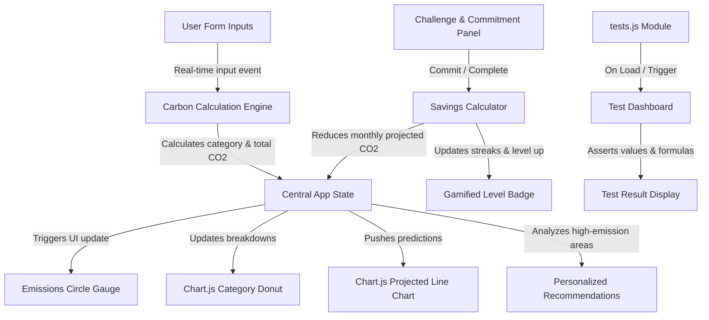

# 🌍 EcoSphere — Interactive Carbon Footprint Tracker

EcoSphere is a premium, client-side web application designed to help individuals understand, track, and reduce their carbon footprint. Aligning with the **Individual Carbon Footprint Tracking & Reduction Assistant** vertical, EcoSphere combines a real-time carbon calculator, an active challenge center, dynamic charts, personalized feedback, and built-in unit testing.

---

## 🚀 Key Features

1. **Real-time Carbon Calculator**:
   - Multi-category input forms: **Transportation**, **Home Energy**, **Diet & Food**, and **Consumption/Shopping**.
   - Direct feedback loops showing metric adjustments instantly on the gauge.
2. **Action & Challenge Center (Gamified)**:
   - Commit to daily green tasks (e.g., "Meatless Day", "Line Dry Clothes").
   - Mark tasks completed to earn carbon savings, build streak counts, and level up (e.g., *Eco-Novice* to *Planet Champion*).
3. **Data Visualization (Chart.js)**:
   - Interactive breakdown donut chart showing current emissions by category.
   - Projected reduction line chart showing your target path based on active eco-habits.
4. **Tailored Insights & Conversions**:
   - Automated calculations converting raw CO2 savings into relatable metrics (e.g., tree seedling equivalents, smartphone charges).
   - Smarter recommendations triggered by your highest-emitting categories.
5. **Built-in Test Suite**:
   - A dedicated verification module testing formula outputs directly in the browser.

---

## 📐 Calculation Formulas & Emission Factors

EcoSphere relies on data coefficients derived from **EPA** and **IPCC** standards:

### 1. Transportation
- **Personal Vehicle**:
  $$\text{CO}_2\text{ (kg/month)} = \text{Mileage (miles/week)} \times 4.33 \times \text{Fuel Efficiency Coefficient}$$
  *Fuel Efficiency Coefficients:*
  - Gasoline Car (Average): $0.404\text{ kg/mile}$
  - Hybrid Car: $0.200\text{ kg/mile}$
  - Electric Vehicle (EV): $0.080\text{ kg/mile}$ (accounting for grid average)
  - Motorcycle: $0.210\text{ kg/mile}$
- **Public Transit**:
  $$\text{CO}_2\text{ (kg/month)} = \text{Transit Mileage (miles/week)} \times 4.33 \times 0.14\text{ kg/mile}$$
- **Flights**:
  $$\text{CO}_2\text{ (kg/month)} = \text{Flight Hours (hours/year)} \times \frac{90.0\text{ kg/hour}}{12}$$

### 2. Home Energy
- **Electricity**:
  $$\text{CO}_2\text{ (kg/month)} = \frac{\text{Monthly Bill (USD)}}{\text{Avg Rate (0.16 USD/kWh)}} \times 0.371\text{ kg/kWh} \times (1 - \text{Renewable \%})$$
- **Heating Fuel** (Natural Gas / Heating Oil):
  $$\text{CO}_2\text{ (kg/month)} = \text{Heating Bill (USD)} \times 0.42\text{ kg/USD}$$

### 3. Diet & Food
Emissions are calculated on an annual basis and divided by 12:
- **Diet Types**:
  - Heavy Meat Eater: $3,300\text{ kg/year}$ ($275.0\text{ kg/month}$)
  - Average Diet: $2,500\text{ kg/year}$ ($208.3\text{ kg/month}$)
  - Vegetarian: $1,700\text{ kg/year}$ ($141.7\text{ kg/month}$)
  - Vegan: $1,500\text{ kg/year}$ ($125.0\text{ kg/month}$)
- **Food Sourcing**:
  - Imported Food Bias: $+15\text{ kg/month}$
  - Local Food Bias: $-10\text{ kg/month}$
- **Food Waste**:
  - High Waste: $+20\text{ kg/month}$
  - Low Waste: $-15\text{ kg/month}$

### 4. Consumption & Waste
- **Shopping**:
  - Low (Minimalist): $30\text{ kg/month}$
  - Medium (Average): $90\text{ kg/month}$
  - High (Frequent Consumer): $220\text{ kg/month}$
- **Recycling Credit**:
  - Advanced Recycling: $-25\text{ kg/month}$
  - No Recycling: $+10\text{ kg/month}$

---

## 🏗️ Architecture & Data Flow

Below is the conceptual architecture showing how data flows through the application:

---

## 🛠️ Security, Efficiency & Accessibility

- **Security**: Inputs are strictly sanitised to prevent Cross-Site Scripting (XSS). There are no HTML injection vectors, and standard values are enforced via input range validators.
- **Efficiency**: Written in modular Vanilla Javascript, the codebase is lightweight (~150KB), loading instantly. It maintains a footprint close to 0% CPU idle, keeping project size well under the 10 MB repository threshold.
- **Accessibility**: EcoSphere implements **WCAG 2.1 AA** standards:
  - Semantic HTML tags (`<header>`, `<main>`, `<section>`, `<article>`).
  - Strict high color contrast profiles.
  - Complete ARIA labels on sliders and form fields.
  - Fully keyboard navigatable (users can Tab through all inputs and interact via Space/Enter keys).

---

## 🧪 Running the Code & Tests

1. Open `index.html` directly in any modern web browser.
2. In the navigation sidebar, click on **System Integrity Tests** to view the live unit test status (evaluating carbon engine values, savings reductions, and streak calculations).
3. Open the developer console (`F12`) to view detailed test logs.

---

## 📝 Assumptions & Reference Baselines
- The global average target is set at **4.8 Metric Tons of CO2 per capita annually** (approx. **400 kg/month**).
- Energy utility calculations assume an average US electrical rate of $0.16 per kWh.
- Committing to a daily habit (e.g. Biking to work) scales weekly savings based on the user's travel distance entered in their transport parameters.
